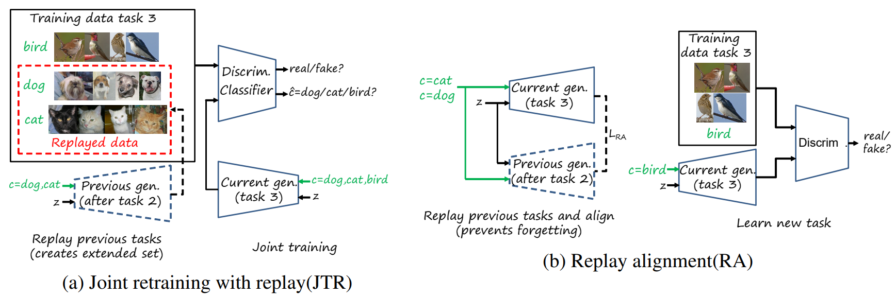
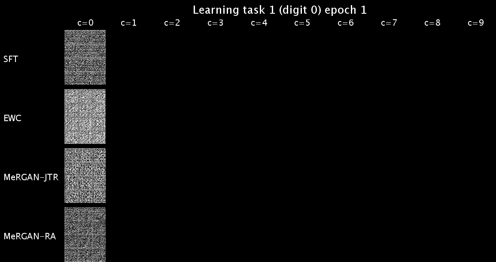
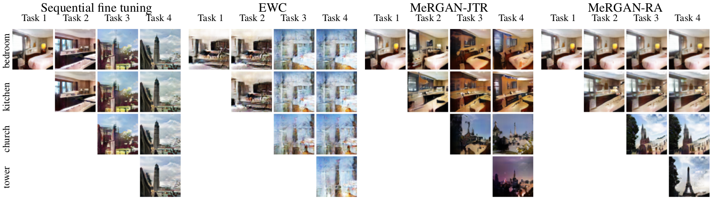

Memory Replay GANs: learning to generate images from new categories without forgetting
=====================================
The paper has been accepted in NIPS 2018. An [arXiv pre-print](https://arxiv.org/abs/1809.02058) version, a [blog](http://www.lherranz.org/2018/10/29/mergans) and a [video](https://youtu.be/zOHrHrVq5C8) are available.


## Method


## Dependences 
- Python2.7, NumPy, SciPy, NVIDIA GPU, Tensorflow 1.4
- **Dataset:** 
  - MNIST
  - SVHN(http://ufldl.stanford.edu/housenumbers/)
  - LSUN(bedroom, kitchen, church outdoor, tower)(http://lsun.cs.princeton.edu/2017/)
 
## Usage

For training:
- `python mergan.py --dataset mnist --result_path mnist_SFT/` Sequential Fine Tuning
- `python mergan.py --dataset mnist --RA --RA_factor 1e-3  --result_path mnist_RA_1e_3/` MeRGAN Replay Alignment
- `python mergan.py --dataset mnist --JTR --result_path mnist_JTR/` MeRGAN Joint Training with Replay
- `python joint.py --dataset mnist --result_path mnist_joint/` Joint Training

For testing:
- `python mergan.py --dataset mnist --test  --result_path result/mnist_RA_1e_3/`
- `python joint.py --dataset mnist --test --result_path result/mnist_joint/`

## Results
### MNIST


### LSUN


## References 
- \[1\] 'Improved Training of Wasserstein GANs' by Ishaan Gulrajani et. al, https://arxiv.org/abs/1704.00028, (https://github.com/igul222/improved_wgan_training)[code] 
- \[2\] 'Transferring GANs generating images from limited data' by Yaxing Wang  et. al, https://arxiv.org/abs/1805.01677, (https://github.com/yaxingwang/Transferring-GANs)[code]

## Citation

Please cite our paper if you are inspired by the idea.
```
@inproceedings{chenshen2018mergan,
title={Memory Replay GANs: learning to generate images from new categories without forgetting},
author={Wu, Chenshe and Herranz, Luis and Liu, Xialei and Wang, Yaxing and van de Weijer, Joost and Raducanu, Bogdan},
booktitle={Conference on Neural Information Processing Systems (NIPS)},
year={2018}
}
```
